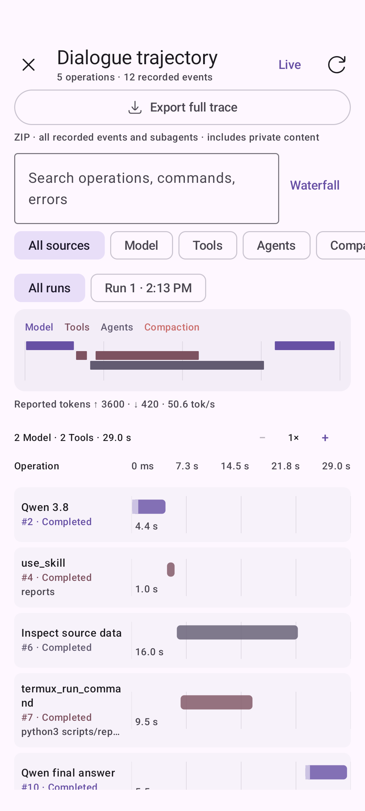
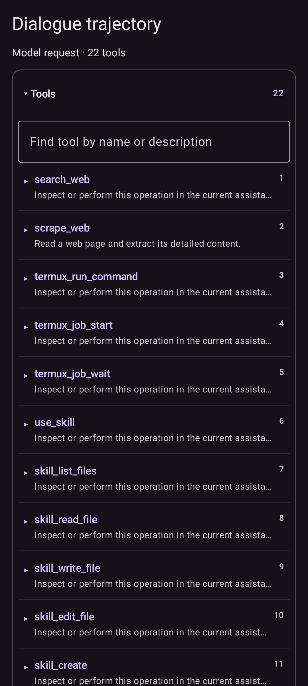
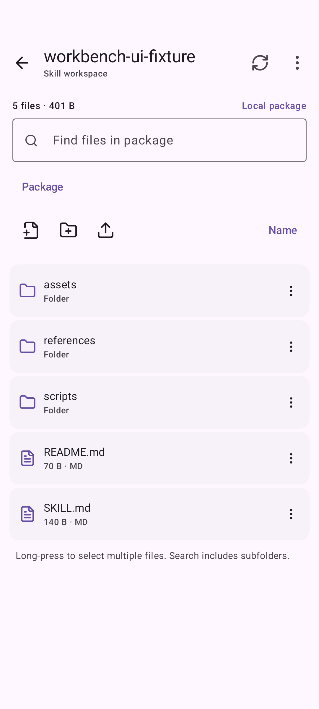

# ReBro Agent

**Long tasks. Visible traces. Complete skills in Termux.**

An Android assistant with checkpointed agent tasks, a visual trajectory inspector, 
a skill workspace, and the bundled ReBro and NetBro assistants.

[Русский](README.md) · **English**

[Install](docs/getting-started.md#install) · [What's different](#changes) · [Screenshots](docs/screenshots.md) · [Documentation](docs/README.md) · [Build](docs/building.md)

**2.5.1-rebro.4:** workspaces linked to real Termux directories, ReBro/NetBro assistant-backed subagent profiles, the green NetBro avatar and a separate ReBro Agent release build. [Setup, data migration and APK signing](docs/termux-workspaces-and-release.md).

This is a development fork of [ExTV/RikkaHub Agent](https://github.com/ExTV/rikkahub-agent), built on [RikkaHub](https://github.com/rikkahub/rikkahub). It brings together our work on long agent tasks, inspection of model/tool activity, and skills that include executable scripts and resources. The native chat client, model providers, and device integrations remain its foundation.

**ReBro Blue:** midnight-navy surfaces, blue actions, steel text and a ninja anteater mascot, with matching light/dark palettes. Existing installations can select **Theme settings → ReBro Blue → Apply**. [New screens](docs/screenshots.md#rebro-blue) · [Trace findings](docs/trace-review-2026-09-24.md) · [Upstream integration review](docs/upstream-review-2026-09-24.md).

## See the changes

<table>
  <tr><th>Shared-time waterfall</th><th>Tool names at a glance</th><th>Files inside a skill</th></tr>
  <tr>
    <td></td>
    <td></td>
    <td></td>
  </tr>
</table>

Actual Android UI captures using test fixtures. Click an image for full resolution. [Explore all 14 screens →](docs/screenshots.md)

## What this fork adds

These are changes in our development line relative to the ExTV base we started from, not claims about future upstream versions.

| Area | Change | What it enables |
|---|---|---|
| **ReBro Blue** | Navy/blue/steel light and dark palettes, adaptive/themed icons and a mascot | A consistent identity while preserving saved theme choices |
| **Dialogue trajectory** | Waterfall, flow, filters, search, inspector, operation JSON and full-trace ZIP export | Follow requests, tool calls and time spent |
| **Readable payloads** | Tool names and descriptions, message roles and excerpts, field previews before expansion | Find an operation without opening numbered cards one by one |
| **Agent runtime** | Checkpoints, continuation across loop limits, cancellable waits for transient network failures | Keep a long task moving without repeated “continue” prompts |
| **Live steering** | Queued updates enter the same task after its current operation | Adjust work without Stop or waiting for the task’s final answer |
| **Compaction** | Configurable deadlines and concurrency, retained evidence, source validation when saving | Compress long histories without committing stale summaries |
| **Metrics** | Measured content-receiving TPS and expandable details below the message | Separate model response speed from command execution and waiting |
| **Termux diagnostics** | Specific failure hints, per-call preview limits and archived full output | Repair the failing step and keep repeated requests smaller |
| **Termux workspace** | A linked real directory, editor, import/export and command console | Work with original project files and durable jobs from the app |
| **Bro subagents** | ReBro and NetBro profiles link to their saved assistants | Dispatch with their own skills, tools, search and workspace |
| **Termux jobs** | Persistent background jobs, stdout/stderr pages, read cursors, cancellation and job manager | Inspect long commands directly from chat |
| **Skill workspace** | File operations, code editor, Markdown/image preview, HEX, imports/exports and drafts | Manage skill instructions, scripts and resources inside the app |
| **Skills → Termux** | Versioned full-package transfer with hashes and a returned `skill_root` | Run scripts alongside their assets and references |
| **Tool access** | Independent TTS/Whisper settings, individual exclusions, optional skill editing tools | Control the tool definitions each assistant actually receives |
| **ReBro** | Built-in assistant, adapted system prompt, ten kit 2.3 skills, Termux and Local search | Start with a configured Android analysis and modification workflow |
| **NetBro** | Separate network profile, six BBOT/Nmap/Nuclei/Legba skills, Termux and Local search | Run scoped investigations with bounded load and inspect saved evidence |

## Inspect the agent's work

Open **“+ → Dialogue trajectory.”** Waterfall places model requests, tools, subagents and compaction on one time axis. **Flow** links operations to their source model request. Select a run, zoom 1–16×, search operation summaries or recorded payloads, and inspect inputs, outputs and events.

The operation inspector exposes context, timing, related-operation navigation, copy actions and JSON export. Wide layouts give context and actions their own column. Collapsed payloads show tool names, message roles, excerpts and schema fields; full values remain expandable.

[Waterfall, Flow and inspector screenshots →](docs/screenshots.md#trajectory)

**For debugging, use “Export full trace.”** The ZIP includes complete recorded requests, responses, provider-returned reasoning, tool calls/results, checkpoints and linked subagent journals. Search, filters and display paging do not limit it. It contains JSON/JSONL, original payloads, app metadata and an integrity report. [Archive format and usage, RU →](docs/trace-export.md)

## Work with complete skill packages

Open a skill in **Extensions → Skills** to browse folders, create/move/copy files, edit scripts with syntax highlighting and line numbers, find/replace text, preview Markdown/images, or edit bytes in HEX. Multi-selection, ZIP export, draft recovery and a restorable previous package version are included.

Writes check the package revision and file hash so a concurrent agent edit is not silently overwritten. Edited bundled skills retain user changes on upgrades.

Enable **Settings → Termux → Skills in Termux** to transfer a complete package. The agent receives the exact version directory as `skill_root`; existing jobs keep their earlier revision. Python/Node and system dependencies are installed separately.

Agent editing is opt-in under the assistant's local tools. It exposes `skill_create`, `skill_list_files`, `skill_read_file`, `skill_write_file`, `skill_edit_file`, `skill_manage_files` and `skill_delete`. Without an existing connected skill, skill-tool definitions and automatic skill instructions are omitted from model requests. Connect one existing skill before asking the agent to create its first package.

[Editor, binary view and wide layout →](docs/screenshots.md#skills) · [Full guide and limits, RU](docs/agent-runtime/trajectory-and-termux-skills.ru.md)

## Long tasks with visible state

**Send an update while the agent is working.** It enters the same task after the current model response, tool call or compaction finishes. Ready updates preserve submission order; announced tools that have not started are marked as not executed so the model can reconsider them with the new input. [Queue, Stop and boundary behavior, RU →](docs/live-steering.md)

The agent saves checkpoints and can continue after individual loop limits. The overall task deadline is disabled by default, while request/tool deadlines remain bounded. **Stop**, approvals and loop detection still apply. On app restart, active work resumes only when the saved conversation state matches. Android process termination and force-stop still apply.

Input/output tokens, TPS, overall time and expandable details live below the message. **TPS excludes first-content waiting, tool execution and compaction.** It measures client-side content reception, not GPU decoding. Missing or unreliable measurements display “—”.

Termux job tools return paginated stdout/stderr with their status; previews appear in tool cards. The “+” menu includes jobs and counts, compaction, extensions and Trajectory.

[Runtime, timing and recovery details, RU →](docs/agent-runtime/autonomous-tasks-and-trajectory.ru.md)

## Meet ReBro

ReBro ships with **Termux**, **Local search** and ten skills from kit 2.3:

| Stage | Skills |
|---|---|
| Planning and environment | `rebro-workflow`, `rebro-environment` |
| Acquisition and analysis | `rebro-acquire`, `rebro-analyze` |
| Modification and build | `rebro-patch`, `rebro-build` |
| Signing, installation and verification | `rebro-sign`, `rebro-install`, `rebro-verify` |
| Dynamic analysis | `rebro-frida` |

The full kit 2.3 is included with English instructions: **254 files** covering scripts, references, assets and Frida Pack. The former prompt's 21 detailed sections live in an on-demand `rebro-workflow` reference; the shorter system prompt coordinates **skills + Local search + current local evidence**. It uses the app's configured model and search provider.

The environment profile is a **September 22, 2026 snapshot of an SM-S928B running Android 16**. Adapt it for another device. Bundled skills do not install dependencies or establish that Frida is ready on your phone.

[ReBro setup and migration behavior, RU →](docs/agent-runtime/rebro-assistant.ru.md)

## Meet NetBro

**NetBro** ships as a separate assistant with Termux, Local search and six skills: **BBOT, Nmap, Nuclei, Legba**, environment checks and investigation workflow. Its packages include references, a case template and Python helpers for bounded version checks, host/CIDR scope filtering and XML/JSONL summaries. Long operations use the existing Termux jobs and Trajectory.

The APK bundles skills; external scanner binaries are installed separately in the selected environment. The profile accounts for native Termux/Linux differences, uses live device context and preserves saved profile settings across upgrades.

[NetBro setup, packages and controls, RU →](docs/agent-runtime/netbro-assistant.ru.md)

**All bundled skill instructions are English; replies follow the user's language.** Skills supply procedures, scripts and checks, while Local search supplies current, version-matched documentation. The model compares evidence, chooses actions and verifies outcomes. Applicable loaded skills and verified sources are reused. Upgrades replace only recognized factory ReBro/NetBro prompts; custom edits remain intact. [Source policy and upgrades, RU →](docs/agent-runtime/bro-skills-and-evidence.ru.md)

## Get started

1. **Install this repository's build.** [ARM64 APK and installation guide](docs/getting-started.md#install). ReBro Agent also provides an optimized release variant; the debug CI channel remains available. [Migration and signing](docs/termux-workspaces-and-release.md#release-identity-and-signing).
2. **Configure a provider and model.**
3. **Choose an assistant and its local tool groups.** ReBro and NetBro already have their respective skills and Termux enabled.
4. **Set up Termux** for commands/scripts: RUN_COMMAND, `allow-external-apps=true`, Python and skill transfer.
5. **Open Trajectory** from “+” to inspect a run.

Local search uses the app's search provider. If the selected model's native search is enabled, select **Local** in the chat search menu. See the [setup guide, RU](docs/getting-started.md) for permissions and upgrade details.

## The inherited foundation

RikkaHub and ExTV provide the multi-provider chat client, MCP, subagents, schedules/workflows, Telegram, browser, SSH, Linux workspace, file tools and Android integrations. These are inherited capabilities; the table above identifies this fork's additions. Availability depends on the model, selected tools, Android permissions and configured services.

## Validation and current boundaries

The [successful CI run for `3bf0436`](https://github.com/shizzgar/rikkahub-agent/actions/runs/36057905938) passed **828 JVM, 65 Python and 36 Android tests** and built an optimized release with R8. It covers database migration, saved settings, linked Bro profiles, Termux file RPC boundaries, branding and Android UI. The emulator suite runs the debug variant; release is built separately. The real phone’s Termux connection still needs a device check after installation. [Validation boundary](docs/termux-workspaces-and-release.md#validation-boundary).

- Traces are local and may contain private prompts, commands and results. Inspect exports before sharing.
- Only provider-returned reasoning can be recorded. Deterministic replay and reconstruction of previously unrecorded events are not implemented.
- Editing limits: 256 KiB / 4,000 lines of UTF-8 or 64 KiB of HEX; each package: 200 files / 20 MiB. Larger files can be replaced and exported.
- Skill synchronization is one way, from the app to Termux. Termux-side edits are not automatically imported back.
- Emulator checks do not establish live Termux/Frida behavior or background execution reliability on every physical phone.

## Documentation and contributing

[Documentation map](docs/README.md) · [Build from source](docs/building.md) · [Changelog](CHANGELOG.md) · [Contributing](CONTRIBUTING.md) · [Prepare a bug report](CONTRIBUTING.md#report-a-bug)

## Credits and licenses

Thanks to [RikkaHub](https://github.com/rikkahub/rikkahub) for the chat client, UI and provider infrastructure; [ExTV/RikkaHub Agent](https://github.com/ExTV/rikkahub-agent) for the agent foundation; and [Termux](https://github.com/termux/termux-app) for the execution environment. This fork is independent of upstream maintainers.

Application code uses [GNU AGPL-3.0](LICENSE). Bundled third-party components retain their own licenses, including [Frida Pack](app/src/main/assets/default-skills/rebro-frida/assets/rebro-frida-pack/LICENSE). ReBro kit origins are recorded in [provenance.json](app/src/main/assets/assistant-presets/rebro/provenance.json).
