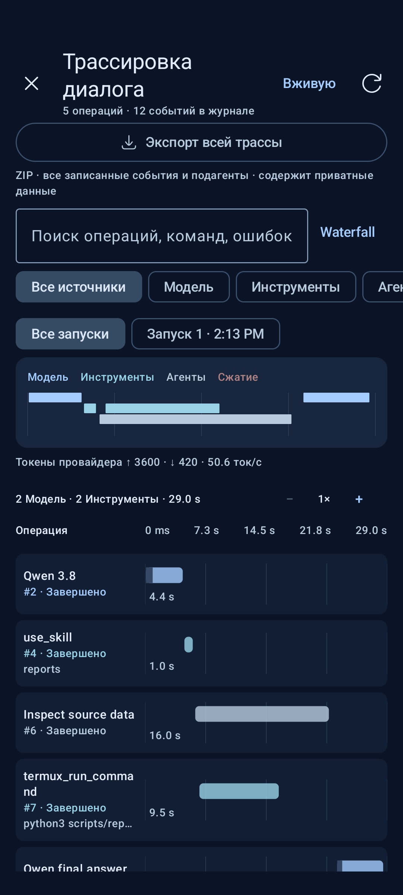

# RikkaHub Agent

**Долгие задачи. Видимая трасса. Полные skills в Termux.**

Android-ассистент с управляемым агентским циклом, визуальной трассировкой, 
мастерской навыков и встроенным профилем ReBro.

**Русский** · [English](README.en.md)

[Установка](docs/getting-started.md#install) · [Отличия](#changes) · [Скриншоты](docs/screenshots.md) · [Документация](docs/README.md) · [Сборка](docs/building.md)

Это развиваемый форк [ExTV/RikkaHub Agent](https://github.com/ExTV/rikkahub-agent), основанного на [RikkaHub](https://github.com/rikkahub/rikkahub). Здесь собраны наши изменения для длительной работы агента, разбора его действий и работы со skills как с полноценными пакетами файлов. Чат, провайдеры моделей и возможности управления устройством остаются основой приложения.

## Посмотреть в действии

<table>
  <tr><th>Трасса выполнения</th><th>Имена tools сразу видны</th><th>Файлы внутри skill</th></tr>
  <tr>
    <td></td>
    <td></td>
    <td></td>
  </tr>
</table>

Реальные снимки интерфейса из Android-тестов с демонстрационными данными. Нажмите на изображение для полного размера. [Галерея из 12 экранов →](docs/screenshots.md)

## Что добавлено в этом форке

Изменения ниже относятся к нашей линии разработки поверх исходной версии ExTV. Это перечень реализованных доработок, а не сравнение с будущими обновлениями upstream.

| Область | Что изменилось | Для чего это нужно |
|---|---|---|
| **Dialogue trajectory** | Waterfall, поток операций, фильтры, поиск, инспектор, JSON операции и ZIP всей трассы | Понять, что агент отправил модели, какие tools вызвал и где потратил время |
| **Данные трассы** | Имена tools, описания, роли сообщений и превью до раскрытия; поиск по всему записанному списку tools | Найти нужный вызов без десятков пустых карточек «1 / 22» |
| **Автономный цикл** | Контрольные точки, продолжение через границы циклов, ожидание временных сетевых сбоев | Продолжать длинную задачу без постоянного «продолжай» |
| **Уточнения на ходу** | Новые сообщения принимаются после текущей операции, внутри той же задачи | Скорректировать работу без Stop и ожидания итогового ответа |
| **Compaction** | Настраиваемые таймауты и параллелизм, сохранение evidence, проверка исходного контекста при записи | Сжимать длинную историю и не публиковать устаревшее резюме |
| **Метрики** | TPS по измеренному получению контента; состояние и подробности под сообщением | Отделять скорость ответа модели от времени команд и ожиданий |
| **Termux jobs** | Сохраняемые фоновые задания, stdout/stderr, курсоры чтения, отмена и менеджер заданий | Следить за долгими командами прямо из диалога |
| **Skill workspace** | Файлы и папки, редактор кода, Markdown/image preview, HEX, импорт/экспорт, черновики | Менять инструкции, скрипты и ресурсы внутри приложения |
| **Skills → Termux** | Передача полного пакета с хешами и версиями, точный `skill_root` | Запускать скрипты вместе с их assets и references |
| **Доступ к tools** | Отдельные переключатели TTS/Whisper, исключение отдельных tools, опциональные tools редактирования skills | Управлять тем, что действительно получает конкретный ассистент |
| **ReBro** | Встроенный профиль, адаптированный системный промпт, 10 skills из kit 2.3, Termux и Local search | Начать работу с готовым набором для анализа и работы с Android-приложениями |

## Трасса, которую можно читать

Откройте **«+ → Трассировка диалога»**. Waterfall показывает запросы модели, инструменты, подагентов и compaction на общей шкале времени. Режим **«Поток»** связывает операции с исходным запросом модели. Доступны выбор запуска, масштаб 1–16×, поиск по операциям и сохранённому содержимому.

Инспектор содержит контекст операции, длительность, вход, выход и события. Из него можно перейти к связанному запросу, соседней операции или трассе подагента, скопировать данные и экспортировать события в JSON. На широком экране контекст и действия занимают отдельную колонку.

Свёрнутые данные уже полезны: tool виден по имени и описанию, сообщение — по роли и началу текста, схема — по именам полей. Полные значения открываются по нажатию.

[Waterfall, Flow и инспектор на скриншотах →](docs/screenshots.md#trajectory)

**Для отладки — «Экспорт всей трассы».** Одна кнопка сохраняет ZIP с полными записанными запросами, ответами, reasoning, tool calls/results, checkpoints и связанными журналами подагентов. Фильтры и страницы интерфейса не ограничивают архив. Внутри — JSON/JSONL, оригинальные payload, сведения о версии приложения и отчёт о целостности. [Формат и использование →](docs/trace-export.md)

## Skills как рабочие пакеты

**«Расширения → Навыки → нужный навык»** открывает мастерскую пакета. Можно создавать и переносить файлы, редактировать скрипты с подсветкой и номерами строк, искать и заменять текст, просматривать Markdown и изображения, менять бинарные данные в HEX. Есть множественный выбор, ZIP-экспорт, восстановление черновика и предыдущего состояния пакета.

Сохранение проверяет ревизию пакета и хеш файла: параллельная правка агента не затирается молча. Изменённые встроенные навыки сохраняют пользовательские правки при обновлении.

Через **«Настройки → Termux → Навыки в Termux»** пакет передаётся целиком. Агент получает каталог конкретной версии — `skill_root`; уже работающая команда продолжает использовать прежнюю версию. Зависимости Python/Node и других программ устанавливаются отдельно.

| Кто редактирует | Как включить |
|---|---|
| Пользователь | Открыть мастерскую навыка |
| Агент | Включить **«Создание и редактирование навыков»** в локальных инструментах ассистента |
| Агент выполняет скрипты | Включить Termux и передачу skills, подключить нужный навык |

Если у ассистента нет подключённых, существующих навыков, определения skill-tools и автоматические skill-инструкции не добавляются в запрос модели. Для создания первого навыка агентом сначала подключите один существующий.

[Редактор, HEX и широкий экран →](docs/screenshots.md#skills) · [Настройка и ограничения →](docs/agent-runtime/trajectory-and-termux-skills.ru.md)

## Долгая работа с понятным состоянием

**Можно дописать уточнение, пока агент работает.** Обычная отправка добавит его в очередь; после текущего запроса модели, tool call или compaction оно войдёт в контекст той же задачи. Несколько уточнений сохраняют порядок. Оставшиеся ещё не запущенные tools пересматриваются с учётом нового ввода. [Как работает подхват, очередь и Stop →](docs/live-steering.md)

Агент сохраняет контрольные точки и может продолжать задачу после лимита отдельного цикла. Общий дедлайн задачи по умолчанию отключён; таймауты запросов и tools остаются ограниченными. Кнопка **Stop**, запросы подтверждения и защита от зацикливания продолжают действовать.

После перезапуска приложения активная задача восстанавливается при совпадении сохранённого состояния. Временные транспортные сбои до содержательного ответа допускают отменяемое ожидание. Android всё ещё управляет жизненным циклом процесса: это не обещание работы после force-stop.

Под сообщением собраны input/output tokens, TPS, общее время и раскрываемые детали. **TPS исключает ожидание первого контента, выполнение tools и compaction.** Это клиентская скорость получения, а не телеметрия инференс-движка. Если надёжного измерения нет, показывается «—».

Фоновые Termux jobs возвращают страницы stdout/stderr вместе со статусом; preview виден в карточке инструмента. Меню «+» содержит менеджер заданий со счётчиками, compaction, расширения и Trajectory.

[Подробности runtime, метрик и восстановления →](docs/agent-runtime/autonomous-tasks-and-trajectory.ru.md)

## ReBro включён в комплект

Отдельный встроенный ассистент с **Termux**, **Local search** и десятью skills:

| Этап | Навыки |
|---|---|
| Организация и окружение | `rebro-workflow`, `rebro-environment` |
| Получение и анализ | `rebro-acquire`, `rebro-analyze` |
| Изменение и сборка | `rebro-patch`, `rebro-build` |
| Подпись, установка, проверка | `rebro-sign`, `rebro-install`, `rebro-verify` |
| Динамический анализ | `rebro-frida` |

Включены **253 оригинальных файла** kit 2.3: инструкции, скрипты, references, assets и Frida Pack. Системный промпт сохраняет 21 раздел исходного профиля и адаптирован к текущей интеграции skills/Termux. Модель и провайдер поиска берутся из настроек приложения.

Профиль окружения ReBro основан на снимке **SM-S928B / Android 16 от 22 сентября 2026**. На другом устройстве уточните его перед работой. Наличие skill не устанавливает системные зависимости и не подтверждает готовность Frida.

[Профиль ReBro и поведение при обновлении →](docs/agent-runtime/rebro-assistant.ru.md)

## Начать работу

1. **Установите сборку этого репозитория.** [Инструкция и ARM64 APK](docs/getting-started.md#install). Сейчас используется канал CI debug-сборок.
2. **Настройте провайдера и модель** в настройках приложения.
3. **Выберите ассистента** и включите нужные группы локальных инструментов. ReBro уже содержит свой набор skills и Termux.
4. **Настройте Termux**, если нужны команды и скрипты: RUN_COMMAND, `allow-external-apps=true`, Python и передача навыков.
5. **Откройте Trajectory** из меню «+», чтобы смотреть ход выполнения.

[Полная настройка, Local search и обновление без потери данных →](docs/getting-started.md)

## Что осталось от основы

От RikkaHub и ExTV сохранены мультипровайдерный чат, MCP, подагенты, расписания и workflows, Telegram, браузер, SSH, Linux workspace, файловые инструменты и интеграции Android. Эти возможности унаследованы; таблица выше выделяет изменения именно нашей версии. Доступность зависит от модели, включённых tools, разрешений Android и настроенных внешних сервисов.

## Проверки и границы

Для версии [`81fea68`](https://github.com/shizzgar/rikkahub-agent/commit/81fea68a154782d4ab6e8fbadee2278e51cbb565) [успешный CI](https://github.com/shizzgar/rikkahub-agent/actions/runs/35875085640) подтвердил **718 JVM-тестов, 21 Python-тест и 20 Android-тестов**. Проверены уточнения во время работы и Stop, полный экспорт трассы, установка ReBro kit по манифестам, доступность tools, UI на эмуляторе в телефонном и широком форматах, а также подпись ARM64 APK. Это зафиксированный результат конкретной ревизии; текущие прогоны видны в [Actions](https://github.com/shizzgar/rikkahub-agent/actions/workflows/compaction-debug.yml).

- Трасса хранится локально и содержит промпты, команды и результаты. Перед публикацией экспорта проверьте его содержимое.
- Записывается reasoning, который вернул провайдер. Полного детерминированного replay и реконструкции старых незаписанных событий нет.
- Редактор: до 256 КиБ / 4000 строк UTF-8 или 64 КиБ HEX; один пакет: до 200 файлов / 20 МиБ. Крупные файлы можно заменить и экспортировать.
- Синхронизация skills идёт из приложения в Termux. Правки в Termux автоматически обратно не переносятся.
- Android-тесты эмулятора не заменяют проверку реального Termux, Frida и ограничений фоновой работы конкретного телефона.

## Документация и участие

[Карта документации](docs/README.md) · [Сборка из исходников](docs/building.md) · [История изменений](CHANGELOG.md) · [Как помочь](CONTRIBUTING.md) · [Подготовить баг-репорт](CONTRIBUTING.md#report-a-bug)

## Авторы и лицензии

Спасибо [RikkaHub](https://github.com/rikkahub/rikkahub) за чат, UI и инфраструктуру моделей, [ExTV/RikkaHub Agent](https://github.com/ExTV/rikkahub-agent) — за агентскую основу, [Termux](https://github.com/termux/termux-app) — за среду выполнения. Этот форк развивается независимо от upstream.

Код приложения распространяется по [GNU AGPL-3.0](LICENSE). Исходные лицензии включённых сторонних компонентов, в том числе [Frida Pack](app/src/main/assets/default-skills/rebro-frida/assets/rebro-frida-pack/LICENSE), сохранены вместе с ними. Происхождение ReBro kit указано в [provenance.json](app/src/main/assets/assistant-presets/rebro/provenance.json).
