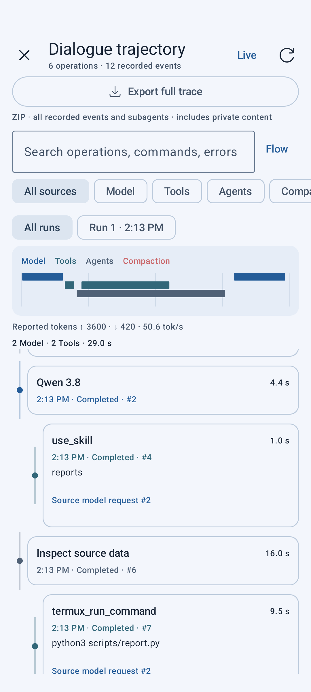
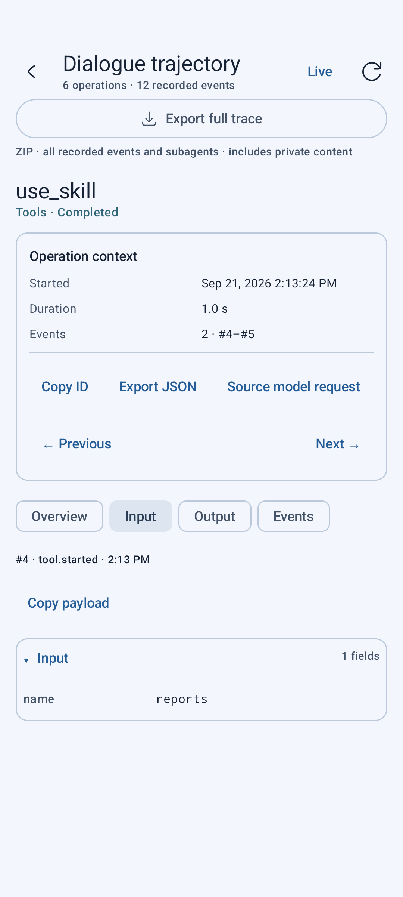
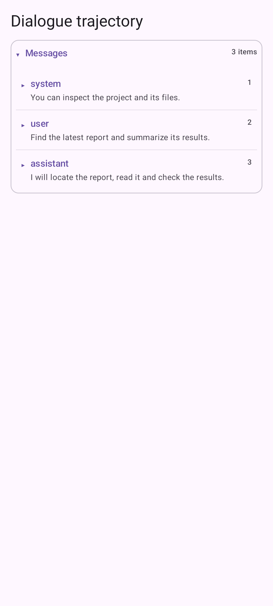
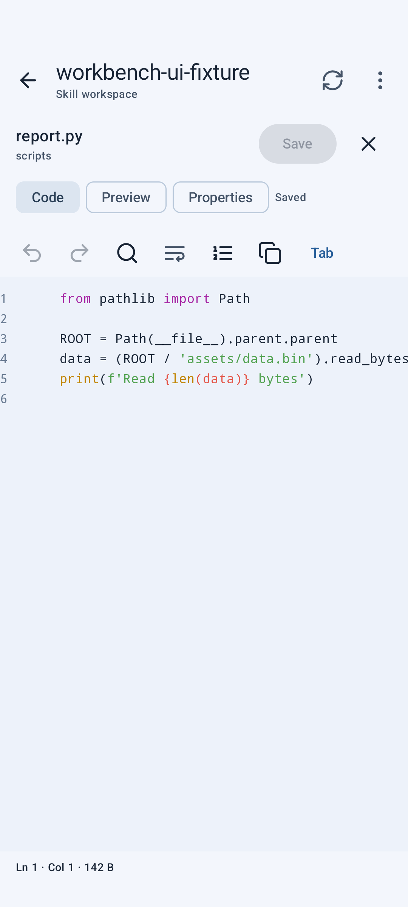
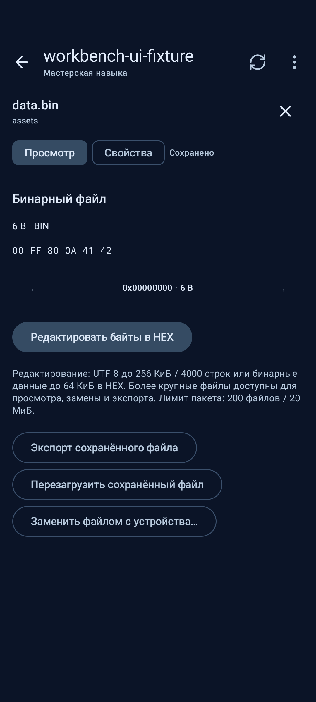
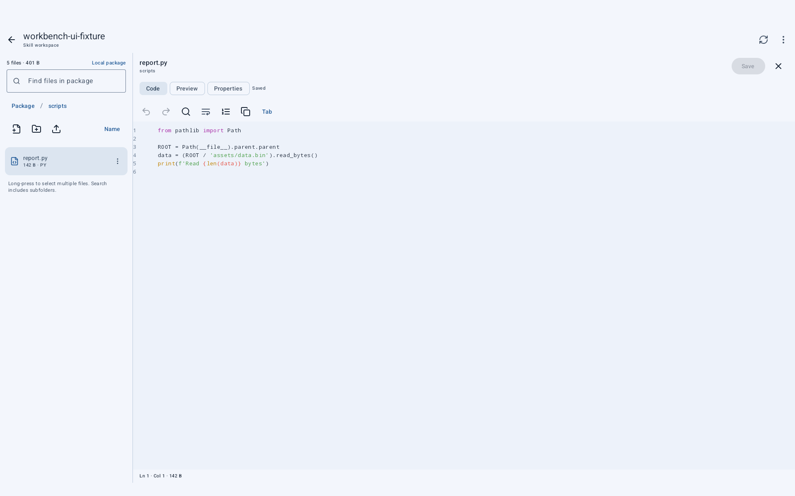
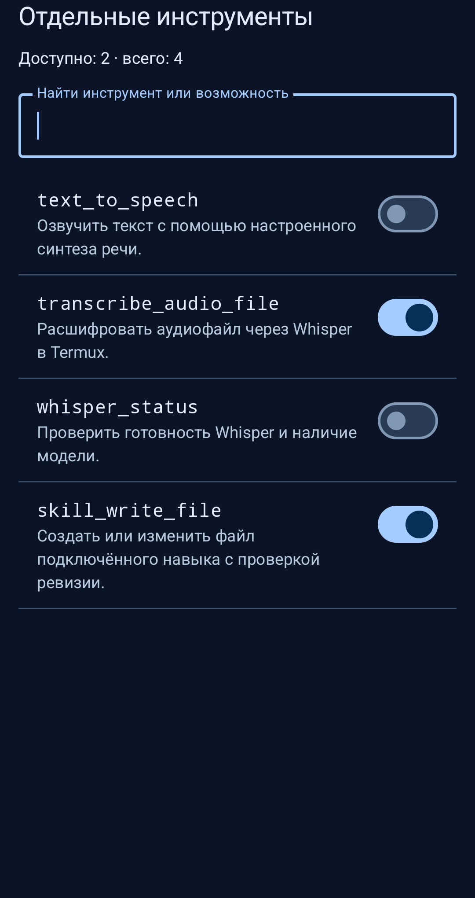
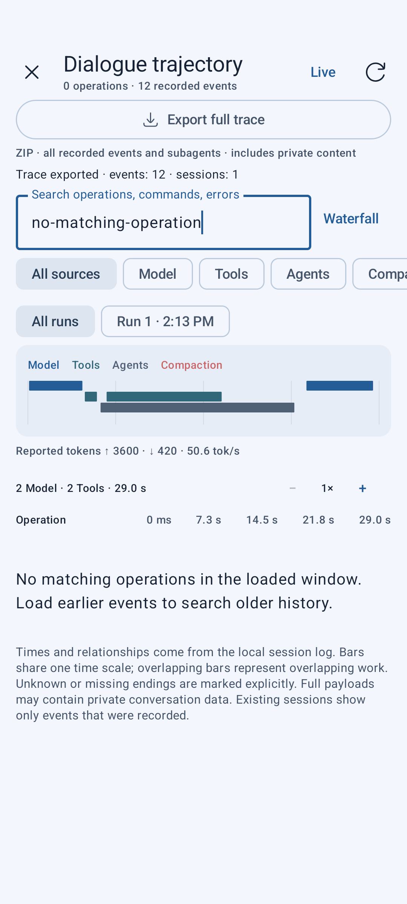
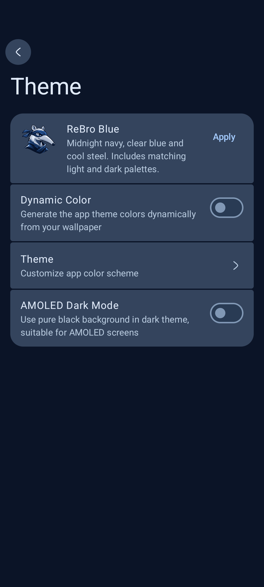
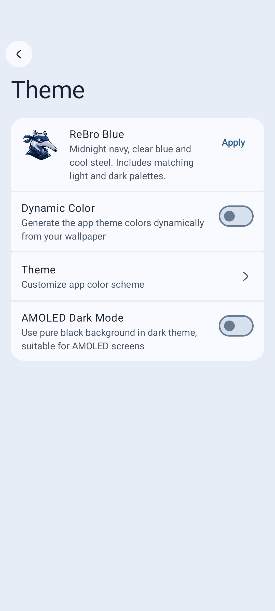

# Галерея изменений

[Обзор проекта](../README.md) · [English overview](../README.en.md) · [Документация](README.md)

Это реальные снимки Android-интерфейса с демонстрационными данными из instrumentation-тестов. Имена `workbench-ui-fixture`, примеры команд, сообщения, токены и времена относятся к тестовому сценарию, а не к замерам на пользовательском телефоне. Изображения сохранены без изменения байтов. Нажмите на снимок для полного размера.

## 01 · Время и связи операций

**Waterfall** помещает модель, tools и подагентов на общую шкалу. **Flow** показывает связи с исходным запросом. В обоих режимах доступны фильтры, поиск и выбор запуска.

<table>
  <tr><th>Waterfall · shared time axis</th><th>Flow · request → tool</th></tr>
  <tr>
    <td></td>
    <td></td>
  </tr>
</table>

## 02 · Контекст операции и локализация

Инспектор сохраняет контекст и действия при переходе между вкладками. Есть копирование, экспорт операции в JSON, переходы к соседям и исходному запросу. Тёмная тема и русский интерфейс используют те же данные трассы.

<table>
  <tr><th>Inspector · context and actions</th><th>Русский · тёмная тема</th></tr>
  <tr>
    <td></td>
    <td></td>
  </tr>
</table>

## 03 · Смысл до раскрытия

Свёрнутые tool declarations показывают **имя и описание**, сообщения — **роль и превью текста**. Поиск работает по всему записанному массиву tools. Полные схемы и содержимое остаются доступными при раскрытии.

<table>
  <tr><th>Tools · names and search</th><th>Messages · roles and excerpts</th></tr>
  <tr>
    <td></td>
    <td></td>
  </tr>
</table>

## 04 · Файлы и код внутри навыка

Мастерская открывает весь пакет: `SKILL.md`, скрипты, references и assets. Файловые операции, редактор с подсветкой и номерами строк, поиск/замена, undo/redo и сохранение доступны внутри приложения.

<table>
  <tr><th>Files · complete package</th><th>Code · editor and navigation</th></tr>
  <tr>
    <td></td>
    <td></td>
  </tr>
</table>

## 05 · Бинарные ресурсы

Бинарный файл показывается побайтно. Отсюда открывается HEX-редактор; также доступны экспорт и замена сохранённого файла. На снимке открыт просмотр бинарного ресурса.

## 06 · Широкий экран

На широком экране дерево пакета и редактор находятся рядом. Это Android-интерфейс на эмуляторе 1920×1200, а не отдельный desktop-клиент.

## 07 · Доступ к отдельным tools

Поиск и переключатели позволяют исключить конкретные инструменты. TTS и Whisper независимы; редактирование навыков агентом включается отдельно. Состояния переключателей на снимке демонстрационные, не значения по умолчанию ReBro.

## 08 · Вся трасса одним архивом

**«Экспорт всей трассы»** доступен вверху экрана, в том числе из инспектора. ZIP содержит весь сохранённый диалог и связанные журналы подагентов: запросы, ответы, reasoning, tool calls/results, checkpoints и диагностику целостности.

На снимке поиск скрывает все операции, но экспорт всё равно сохраняет **12 событий** тестового диалога. Полнота архива не зависит от того, что сейчас видно на экране. [Структура архива и чтение данных →](trace-export.md)

## 09 · ReBro Blue

Настоящий экран настроек после нажатия **«Применить»**. Тёмная палитра использует navy-поверхности, голубые акценты и стальной текст; светлая — холодные светлые поверхности. Маскот встроен в приложение и launcher. Эти снимки сняты с production Compose-экрана; это не сгенерированные макеты.

<table>
  <tr><th>Тёмная тема</th><th>Светлая тема</th></tr>
  <tr>
    <td></td>
    <td></td>
  </tr>
</table>

## Происхождение снимков

Снимки получены в [успешном CI-прогоне](https://github.com/shizzgar/rikkahub-agent/actions/runs/36005633948) для ревизии `8ded6be9b14f34b6bae92c5fc161a1aa36b18189`, Android API 35. Они хранятся в репозитории и не зависят от срока жизни Actions artifacts. Размеры и SHA-256 каждого файла указаны в [provenance.json](media/screenshots/provenance.json).

Сценарии: [Trajectory](../app/src/androidTest/java/me/rerere/rikkahub/ui/pages/chat/TrajectoryInstrumentedTest.kt), [payload](../app/src/androidTest/java/me/rerere/rikkahub/ui/pages/chat/TracePayloadInstrumentedTest.kt), [skill workspace](../app/src/androidTest/java/me/rerere/rikkahub/ui/pages/extensions/skills/SkillWorkbenchInstrumentedTest.kt), [tool access](../app/src/androidTest/java/me/rerere/rikkahub/ui/pages/assistant/detail/ToolAccessInstrumentedTest.kt), [ReBro Blue и launcher](../app/src/androidTest/java/me/rerere/rikkahub/ui/theme/RebroBrandInstrumentedTest.kt).
